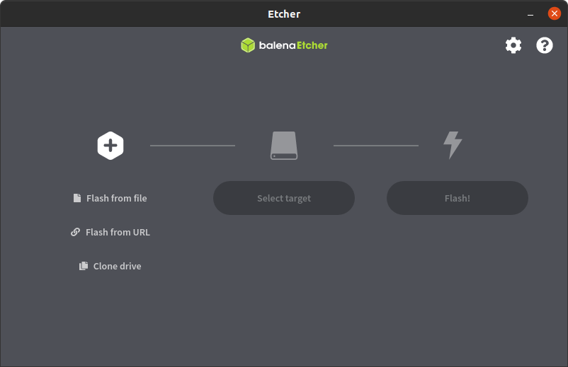
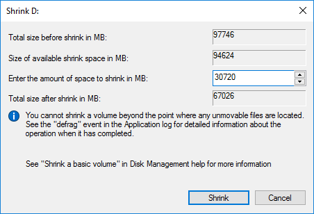
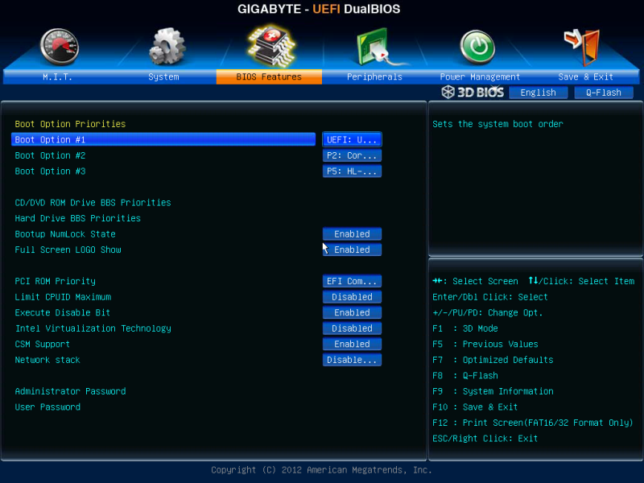
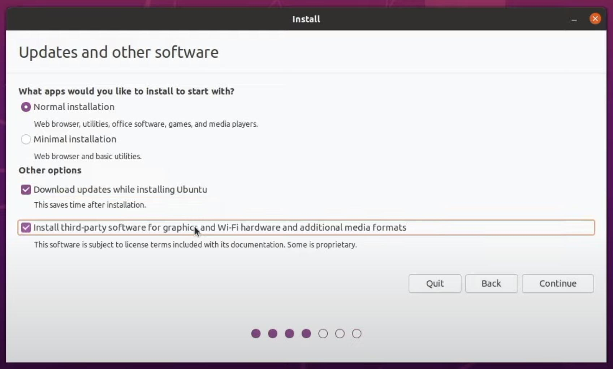
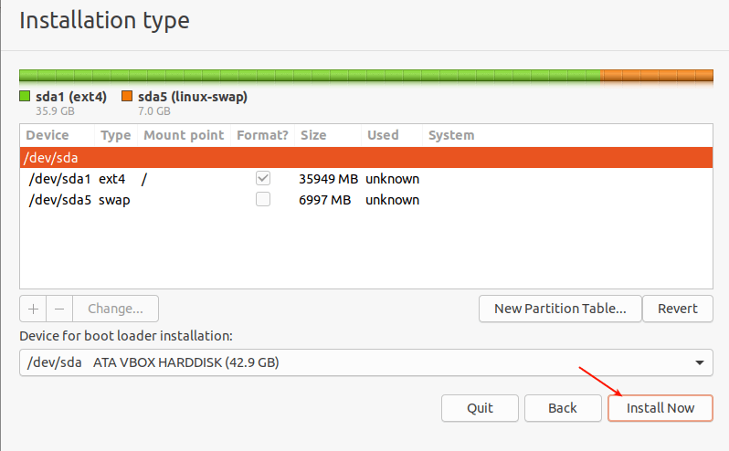
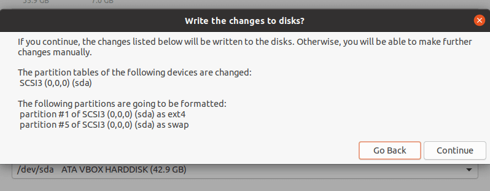

# A Guide to Ubuntu Installtion & Setup


This article offers steps of Linux Ubuntu installation.

<!--more-->


This guide is based on Linux Ubuntu 20.04 LTS. However, the installation steps are similar across other version of Ubuntu.


For developers, a robust and versatile operating system (OS) is important. Apple MacOS is good but you need a Macintosh, sometimes it can be over your budget. Windows is excellence for media consumption and office work but setting it up for a proper development purpose outside of Microsoft application may be challenging.

**Ubuntu** is an Linux distribution based on Debian. It is an open-source OS that can run on many modern System-on-Chips (SoC). 

Some of the key benefits are:

1. It is free!
2. Works on Windows running machine.
3. Dual-boot. Install side-by-side with your Windows OS on a single drive.
4. Huge community support.
5. Excellent developement environment.

## 1 Prepare Ubuntu bootable USB

Ubuntu bootable USB is a portable Ubuntu OS installed on a USB drive. With the bootable USB. You are able to try the Ubuntu desktop experience and install it.

### 1.1 Download the Ubuntu ISO & Etcher

`Ubuntu` is distributed through the official website. The best Ubuntu image is stable Long-Term-Support (LTS) version. It usually is the first choice on the page. [Download latest Ubuntu Desktop image here](https://ubuntu.com/download/desktop).

`Etcher` is a free and open-source software for writing image file into storage media to create bootable USB drive or SD cards. It is available for Windows, macOS and Linux. [Download latest Etcher here](https://www.balena.io/etcher/).

### 1.2 Create Ubuntu bootable USB

Etcher offers a simple GUI with 3 buttons. 





**3 steps to flash Ubuntu in your USB drive:**
1. Click `Flash from file` and select Ubuntu image file on the left.
2. `Select target` USB drive you wish to flash on.
3. Click `Flash!`.

The process may take a few minutes.

**Congratulation! You completed first milestone!** Now you have your Ubuntu USB drive and ready to install !

---
---
---

## 2 Pre Installation

### 2.1 Physical Drive setup for Ubuntu OS

The dilemma is, many of our computer comes with Windows OS pre-installed. It is a bit tricky when we want to use Ubuntu for development on the same machine. We have 3 options:

1. Buy a new HDD/SSD for Ubuntu and `replace the Windows drive`.
2. Buy a new HDD/SSD for Ubuntu `connect the drive in different SATA/NVME slot`, if your machine can support more than 1 drive.
3. Install Ubuntu on the `same physical drive with Windows OS`.

If your plan is first option, you can skip to section `#2.2`.

If you plan is second or third option, you are making your Ubuntu **Dual-Boot** in your machine. Please follow the note below.


Physically disconnect all drives in your machine before you proceed with installation, except the SSD/HDD you wish to install Ubuntu. 

This is to make sure the Ubuntu GRUB (boot loader) is installed in the same drive with Ubuntu OS.



Assumed you have typical Windows setup, main OS installed on *C:* volume and *D:* volume as storage. You may shrink either *C:* or *D:* volums depending on your use case.

**Use Windows's Disk Management to re-structure disk volume:**
1. Press `Windows key` + `x` and select Disk Management from the list.
2. Right click the volume you wish to shrink and select `Shrink Volume`.
3. Enter the amount of space  and click `Shrink` to execute.


Now you can see a new unused volume beside the volume you have shrinked. Next step is to install Ubuntu OS on the volume.


### 2.2 Change boot order of your machine

Every computer will have a boot order setting in the BIOS/UEFI. If the computer has multiple bootable drive attached, the first drive in the boot order will be booted.

Move the *Ubuntu bootable USB drive* to the top of the boot order to ensure your computer will boot into that USB drive.


Make sure your *Ubuntu bootable USB* is plugged into USB port before the computer booting-up. If you cannot find the Ubuntu USB in boot order, please restart your computer.

To get maximum speed during installation, you are advised to avoid connect the bootable drive to [USB port extension](https://www.google.com/search?q=usb+port+extension). For the best result, please consider on-board USB 3.x port.


Different OEM laptop or motherboard may have different trigger to boot in BIOS/UEFI. The trigger key usually is `Del` or `F2`. Upon the boot screen appears on your computer screen, hit the trigger key. Restart your machine if you missed it. 





Successful trigger will bring you to BIOS/UEFI menu. Navigate to page contains **Boot** option. The page will shows the current *Boot Option* order to the corresponding drives. Change the **Boot Order #1** to the *Ubuntu bootable USB*. Save the current setup at the last page of BIOS/UEFI menu and exit. Your machine will reboot.





---
---
---

## 3 Start to install Ubuntu

The machine booted in *Ubuntu bootable USB* will show a BIOS-like black screen with few options. For first time Ubuntu user, you are encourage to select **Try Ubuntu without installing** and get the first taste of Ubuntu. The option will bring you to a standard Ubuntu Interface with some basic function. In fact, you may also able install Ubuntu OS to your machine in this option.





In the GUI, you may see the `Intall Ubuntu 20.04 LTS` (*The version number will vary based on the version you are installing*). Double click the desktop icon and you will be able to install the OS to your machine.





So you have clicked `Install Ubuntu 20.04 LTS` and you will see a windows pops out and prompt you to choose the language. You can choose any language you comfortable with. 

After the language, you have to select apps installation options. For normal development, I suggest you follow the the **Installation Tips #1** below. 


For **NVIDIA CUDA** development , please untick **Install third party software for graphic...** box. To avoid NVIDIA CUDA issue, we have to install graphic driver separately after the OS installation.






### 3.1 Disk Partition

In the page **Installation type**, you will need to partition your drive for Ubuntu OS. Please select `Something else` and continue.

The table is the guideline for partition. You may change the Size accoridng to your needs. 

| Partition | Size(MB) | Type | Location | Use as | Mount point |
| :-------- | :------- | :--- | :------- | :----- | :---------- |
| EFI | 500 | Primary | Begining of this space | EFI System Partition | N/A |
| SWAP  | Double of your RAM size | Logical | End of this space | swap area | N/A |
| OS  | Remaining space | Primary | Begining of this space | Ext4 journaling file system | / |


Select the free space and create partitions by `New Partition Table` for each particular purpose stated in the [table](#31-disk-partition).

It is recommended to select `Format` option for **OS partition**.





After finished partitioning the drive, you can now select the main `Device`, in this case `/dev/sda` to `Install Now`





Ubuntu OS installer will warn you about the changes in partition table you have selected. Make sure you selected the correct drive to install Ubuntu then `Continue`.




### 3.2 Timezone & Account

You have completed the hardest part of the installation! Now you can select your `Timezone` and your `Username & Password`.

### 3.3 Finishing Up

Now you can sit back and have a cup of coffee while your Ubuntu is brewing.


Please select `Restart Now` when Ubuntu OS installer told you so.





The machine will ask you to remove the *Ubuntu bootable USB* before it reboot. Do it and hit `Enter`


---
---
---

## 4 Post Installation

Ta Daa!! Now you should see your Ubuntu welcome screen. Your dev life start by clicking on your username !

Now, once you log in the first time, Ubuntu will ask you several setup. For example, **Connect Online Accounts**, **Livepatch** and **Help improve Ubuntu**. You may do it to suit your case. Personally I will say *No* to all.



To update any installed packages
``` bash
sudo apt update
sudo apt upgrade
```


